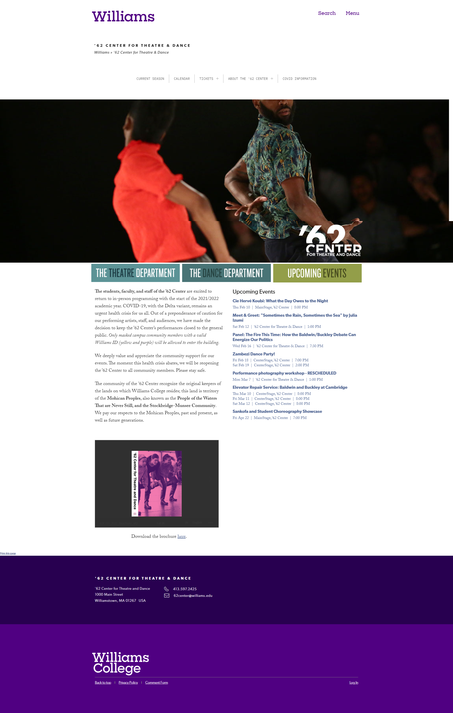

# Williams College Default Theme
Current departmental theme for Williams College, fully responsive and WCAG2.1 accessible, utilizing 
Twig/Timber templating engine to separate presentation from logic, as well as the Beaver Builder 
templating engine with custom modules.

[See the theme in the wild.](https://62center.williams.edu/)

Homepage

